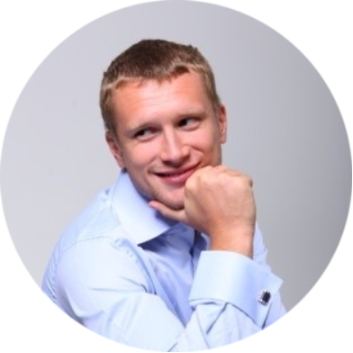

# CV


## **Andrey Nenashev**
 
Batumi, Georgia\
E-mail: anenashev89@gmail.com\
Phone: +995 595-072-389\
Discord: Andrey Nenashev#5348\
Telegram: @andreynen28
### **ABOUT ME**
Hi! I am a person who changes his life and field of activity to web development. I want to improve my development skills. In the future, I would like to work in a strong team on extraordinary projects. My main goal is to become a front-end developer and help companies solve problems online.
### **Skills**
- HTML5, CSS3
- Sass/SCSS
- JavaScript
- GitHub, Terminal
- VSCode
- Figma
 
### **Code example**
```
module.exports = function reverse (n) {
  return Math.abs(n).toString().split('').reverse().join(''); 
}
```
### **Experience**

#### 2022 - 2023

- Javascript Frontend | Rolling Scopes School, student
  - [Plants](https://rolling-scopes-school.github.io/andrey28121989-JSFEPRESCHOOL2022Q4/plants/)
  - [Momentum](https://andrey28121989-momentum.netlify.app/)\
  [Certificate](https://app.rs.school/certificate/upj3fxx0)

### **Education**

#### 2022 - 2023
- Rolling Scopes School | Frontend Development, stage 1 | JavaScript
- Rolling Scopes School | Frontend Development, stage 0 | HTML5, CSS3 (Sass/SCSS), JavaScript
#### 2007 - 2012
- Samara State Construction University
 
### **Languages**
- Russian: Native speaker
- English: A2 Pre-intermediate
